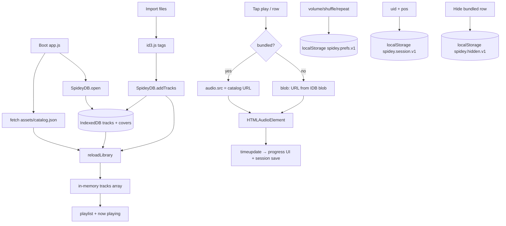

# Phase 0 — Reverse-engineer Spidey Player

**Project:** Spidey Player 2.0  
**Stack (verified):** vanilla HTML/CSS/JS, IndexedDB (`db.js`), localStorage prefs, static `assets/catalog.json` + MP3 URLs, service worker PWA. No framework, no server API.

**Constraint conflict (surfaced, not guessed):** the master brief says “localStorage only.” This codebase **already uses IndexedDB** (`MusicAppDB`) to store imported `File`/`Blob` audio. Audio blobs cannot live in localStorage (quota ~5 MB, no binary). IndexedDB stays the store for imported media. localStorage stays the store for JSON prefs/session. A future backend would sit behind `SpideyDB`, not replace it in this phase.

---

## What the code does

| File | Real responsibility |
|------|---------------------|
| `index.html` | Shell: now-playing card, playlist drawer, PWA meta, script order `id3.js` → `db.js` → `app.js`. |
| `app.js` | Entire runtime: playback, playlist, prefs, catalog merge, PWA install, Media Session, visualizer. One IIFE. |
| `db.js` | IndexedDB v2: `tracks` + `covers`. Import, delete, restore, prune, storage estimate. Exposes `window.SpideyDB`. |
| `id3.js` | Tag reader (ID3v1/2, FLAC). Used only on **import**, not on bundled catalog tracks. |
| `style.css` | Glass UI, player dock, mobile `dvh` shell, playlist drawer. |
| `sw.js` | PWA caches. Catalog is network-first (v6+). Audio Range not intercepted. |
| `assets/catalog.json` | Bundled library metadata (local: 177 tracks, relative `assets/music/…`). |
| `assets/catalog.cloud.json` | Production catalog: same titles, `src` = Vercel Blob HTTPS URLs. Copied over `catalog.json` on Vercel via `scripts/prepare-cloud-catalog.js`. |
| `scripts/*` | Offline asset pipeline (catalog, covers, cloud pack). Not loaded in the browser. |
| `test/id3.test.js` | Node tests for tag parsing. |
| `test/browser-verify.js` | Playwright smoke of the running app. |

---

## Complete data flow

**Transforms**

- Catalog JSON → in-memory track with `uid: 'bundled:' + src`, `bundled: true`.
- IDB row → in-memory track as stored (`blob`, `coverKey`).
- Hidden titles filtered **only** on bundled list (`hidden.has(t.title)`).
- Playback order: `order[]` identity or shuffled copy.
- Cover: bundled uses `track.art` URL; imports use `SpideyDB.getCover` → object URL.

**Duplication**

- Title/artist/album exist on catalog JSON **and** (for imports) IDB records. Bundled tags are filename-derived at catalog build time, not ID3.
- Duration: catalog `duration` **or** `audio.duration` written back only for non-bundled tracks.

---

## State inventory

| Data | Source of truth | Also lives in | Notes |
|------|-----------------|---------------|--------|
| Bundled track list | `assets/catalog.json` | SW cache (network-first) | Cloud deploy swaps file at build. |
| Imported tracks | IndexedDB `tracks` | `tracks[]` RAM | Blobs not in localStorage. |
| Cover images (imports) | IndexedDB `covers` | object URLs in `coverCache` | |
| Hidden bundled titles | `localStorage spidey.hidden.v1` | `Set hidden` | Comment/toast say “session”; storage is durable. **Two stories.** |
| Last track + position | `localStorage spidey.session.v1` | `lastSession`, `pendingSeek` | |
| Volume/mute/shuffle/repeat | `localStorage spidey.prefs.v1` | `audio.*`, `isShuffle`, `repeatMode` | |
| iOS banner dismissed | `localStorage spidey.ios-banner-dismissed.v1` | | |
| SW reload guard | `sessionStorage spidey.sw-reloaded` | | |
| Current index | RAM `currentTrack` | derived from session uid on boot | |
| Playing flag | RAM `isPlaying` from `audio` events | Media Session `playbackState` | |
| Progress | `audio.currentTime` / `duration` | DOM bar + times | |
| Track count | `tracks.length` + search `visible` | `#track-count` | Hidden bundled omitted from `tracks`. |
| Storage line | `navigator.storage.estimate()` | `#storage-usage` | **Origin-wide**, not library bytes. |
| Import line | RAM during `addTracks` | `#import-status` | Also boot copy “Opening your local library…”. |

Competing sources of truth:

1. Hidden: code comments + toast vs localStorage durability.  
2. Duration: catalog number vs live `audio.duration`.  
3. Storage UI: estimate vs actual IDB library size.  
4. Cloud vs local catalog `src`/`art` (same titles, different URLs) — by design.

---

## Persistence contract today

| Key / store | Shape | Writer | Reader | Shape agreement |
|-------------|-------|--------|--------|-----------------|
| IDB `tracks` | `{ uid, name, blob, size, lastModified, fingerprint, contentHash, addedAt, title, artist, album, track, year, duration, coverKey }` | `addTracks`, `updateTrack`, `restoreTrack`, v1→v2 upgrade | `getAllTracks` | Yes, after v2 migration. |
| IDB `covers` | `{ key, blob }` | import path | `getCover` | Yes. |
| `spidey.prefs.v1` | `{ volume: 0..1, muted, shuffle, repeat }` | `savePrefs` | `loadPrefs` | Yes; corrupt JSON → `{}`. |
| `spidey.session.v1` | `{ uid, pos }` | `saveSession` every 3s + beforeunload | `loadSession` on `reloadLibrary` | Yes; invalid JSON → null. |
| `spidey.hidden.v1` | JSON array of title strings | `writeHidden` | `readHidden` | Yes. |
| `spidey.ios-banner-dismissed.v1` | `"1"` | banner close | banner setup | Yes. |

No version field on localStorage JSON except the key suffix `.v1`. No `storage` event (cross-tab). Prefs writes are not atomic (single `setItem`). Quota: prefs warn once; hidden/session fail silent.

---

## Render-path map (displayed values)

| UI | Chain |
|----|--------|
| `#song-title` / `#song-artist` / `#song-album` | `tracks[currentTrack]` → `updateNowPlayingUI` |
| `#album-art` | bundled: `track.art`; import: IDB cover blob URL; else `DEFAULT_ART` |
| `#current-time` / `#duration` / `#progress-bar` | `audio.currentTime` / `audio.duration` (bar uses `track.duration` as fallback label on load) |
| Play icon / aria-label | `audio` play/pause → `isPlaying` |
| Shuffle / Repeat / Mute | RAM flags; Repeat also `is-active` class; Mute `aria-pressed` |
| `#track-count` | `updateCounts(visible, tracks.length)` after filter |
| `#storage-usage` | `storageInfo()` estimate + persisted flag |
| `#import-status` | boot string, then import `done/count`, then cleared |
| Playlist rows | `tracks` minus search miss; duration `formatTime(track.duration)` if finite |
| `document.title` | current title |
| Lock screen / notification | `MediaSession` metadata from track + absolute artwork URL |
| Empty playlist copy | `tracks.length === 0` |

Verified in code (not inferred): toast on hide bundled (`app.js` ~1248) claims return next session while `HIDDEN_KEY` is localStorage (`~1395–1420`).

---

## Stop

Phase 0 complete. Phase 1 follows in the next document without waiting (per “don’t stop, implement phase by phase”).
